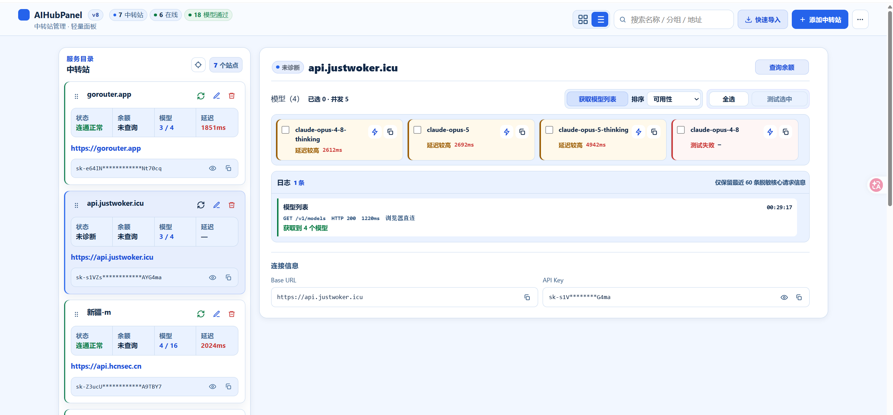

# AIHubPanel

中转站管理 · 轻量面板。把一堆 API 中转站的余额、连通性、模型列表和模型测试收拢到一个本地面板里，不用再挨个开后台查。



## 这是什么

同时用好几个 API 中转站（New API、Sub2API 这类 OpenAI 兼容网关）的时候，想看余额、测哪些模型能用、确认 key 还没过期，得分别登录各家后台，来回切很烦。AIHubPanel 就是干这个的：填好 Base URL 和 API Key，连通性、余额、模型目录、单模型和批量模型测试都能在页面上直接点，结果汇总在一起看。

数据全存在浏览器本地（localStorage），不经过任何第三方服务器。请求默认走浏览器自己的网络通道；碰到站点没开 CORS 的情况，可以启动自带的本地服务做同源转发。

## 运行

需要 Node.js（建议 18+），没有其它依赖，clone 下来直接跑：

```bash
node server.mjs
```

默认监听 `http://127.0.0.1:4179`。Windows 下也可以双击 `start-aihubpanel.bat`，它会自动打开浏览器。

几个环境变量可以调：

| 变量 | 作用 | 默认 |
| --- | --- | --- |
| `AI_HUB_PORT` | 监听端口 | `4179` |
| `AI_HUB_HOST` | 监听地址，改成局域网 IP 可在手机/其它设备访问 | `127.0.0.1` |
| `AI_HUB_ALLOWED_ORIGIN` | 非回环监听时必须设置，指定允许调用转发的来源 | 无 |
| `AI_HUB_PROXY_TIMEOUT_MS` | 转发请求超时 | `120000` |

> 如果只把 `public/` 当静态文件托管，面板本身也能用，直连支持 CORS 的站点没问题；启动 `server.mjs` 主要是为了在 CORS 失败时自动接管转发。

## 功能

- **站点管理**：多个中转站集中管理，支持分组、搜索、拖拽排序。快速导入能直接粘贴 NewAPI 的连接导出文本，自动识别 Base URL 和 Key。
- **连通性 + 延迟**：一键探测站点是否可达，显示 RTT。先试带凭据的接口，被 CORS 拦了再用 no-cors 探测网络层可达性，不会把无效 key 误判成已验证。
- **余额**：兼容 New API、Sub2API 等几套余额接口路径，自动按顺序探测，不用手动指定。
- **模型列表**：拉取 `/v1/models`，支持按名称、状态排序。
- **模型测试**：单个点闪电图标测，也能勾选一批批量测。批量有并发上限和进度节流，上百个模型也不会卡页面。
- **认证兼容**：Bearer 失败（401/403）后自动换 x-api-key 重试一次，适配只认其中一种的网关。GET/HEAD 才会自动重试，POST 这类有副作用的不会。
- **两种视图**：网格视图点开进专注页；列表视图左边列表右边详情常驻。
- **导入导出**：导出 JSON 备份（含 API Key，注意保管），换浏览器或迁移时用。
- **主题**：浅色 / 深色 / 跟随系统。

## 本地转发的安全设计

`server.mjs` 里那个转发接口容易被当成 SSRF 入口，所以做了几层限制：

- 只允许 `http`/`https`，拒绝带账号密码的 URL；
- 发请求前解析域名，拒绝 `localhost`、环回、私有、链路本地和保留地址段（覆盖 IPv4 和 IPv6，含 IPv4-mapped 地址）；
- 锁定已校验过的 IP，防止 DNS rebinding；
- 拒绝上游重定向，避免 key 被转发到别的域名；
- 默认只绑 `127.0.0.1`；要局域网访问必须显式设置 `AI_HUB_ALLOWED_ORIGIN`，防止变成开放代理；
- 同源校验，只接受面板页面发出的请求。

## 项目结构

```
server.mjs              本地服务 + 受限同源转发
start-aihubpanel.bat     Windows 一键启动
public/
  index.html
  app.js                 前端逻辑（原生 JS，无框架无构建）
  app.css
screenshots/
  img1.png
```

前端是原生 JavaScript，没有框架、没有构建步骤，改完刷新就能看效果。
